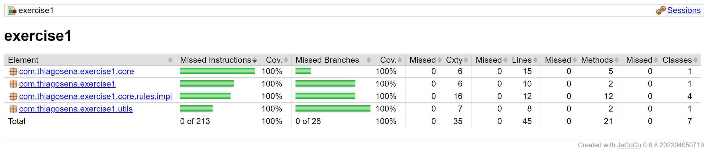

# Exercise 1

## Description

Write or describe an algorithm that prints the whole integer numbers to the console, start from the number 1, and print
all numbers going up to the number 100. However, when the number is divisible by 3, do not print the number, but print
the word 'Visual'. If the number is divisible by 5, do not print the number, but print 'Nuts'. And for all numbers
divisible by both (eg: the number 15) the same, but print 'Visual Nuts'. How will you keep this code safe from bugs?
Show how you would guarantee that this code keeps working when developers start making small feature adjustments. (Maybe
we would want to print the first 500 numbers, ...).

## How to run locally on your machine :gear:

### Requirements

- Git
- Java 17
- Apache Maven

```shell
git clone git@github.com:thiagosena/visualnuts-exercises.git
cd visualnuts-exercises/exercise1
mvn clean package
java -jar .\target\exercise1.jar 1 10
```

## How to run on docker :gear:

### Requirements

- Git
- Docker

```shell
git clone git@github.com:thiagosena/visualnuts-exercises.git
cd visualnuts-exercises/exercise1
docker build -t exercise1 .
docker run  -e INITIAL_VALUE=1 -e FINAL_VALUE=15 -it exercise1:v1
```

## How to run on docker-compose :gear:

### Requirements

- Git
- Docker
- Docker-Compose

```shell
git clone git@github.com:thiagosena/visualnuts-exercises.git
cd visualnuts-exercises/exercise1
docker-compose up --build
```

## Libraries used 🛠

- [**Maven**](https://maven.apache.org/): Build and dependecy control
- [**JUnit 5**](https://junit.org/junit5/): Implementação de casos de testes

## Lint and Teste Coverage 🛠

- [**SonarLint**](https://www.sonarlint.org/intellij): Integrated with Intellij IDE
- [**JaCoCo**](https://github.com/jacoco/jacoco): Test coverage

<p align="center">
  
  <br/>
  <span>Figure 1: JaCoCo home screen with 100% of test coverage</span>
</p>
