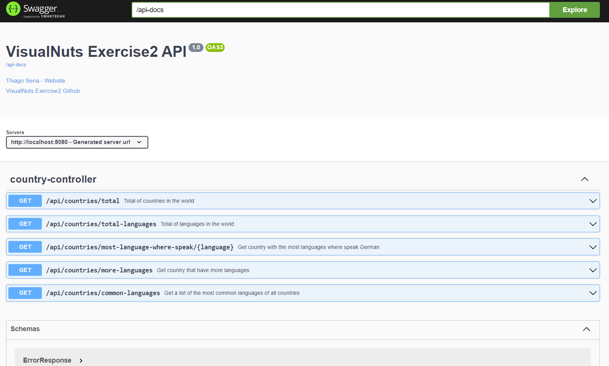
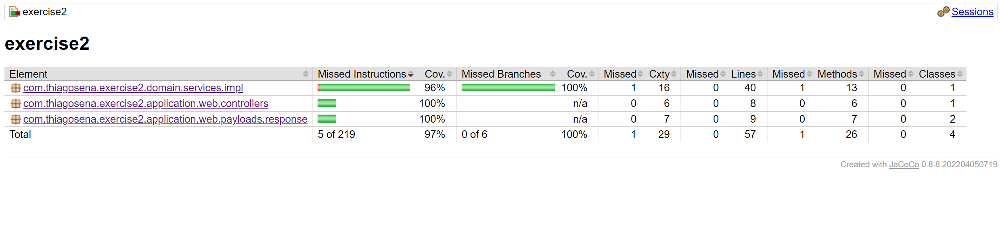
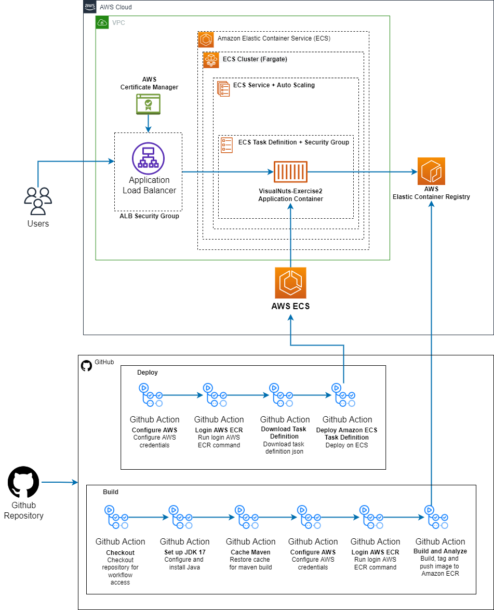

# Exercise 2 :computer:

## How to run the project on your machine :rocket:

### Requirements

- Git
- JDK 17
- Apache Maven

```shell
git clone git@github.com:thiagosena/visualnuts-exercises.git
cd visualnuts-exercises/exercise2
mvn spring-boot:run
```

After compiling the project, just access the address [http://localhost:8080](http://localhost:8080)

## How to run the project on docker :rocket:

### Requirements

- Git
- Docker
- Apache Maven

```shell
git clone git@github.com:thiagosena/visualnuts-exercises.git
cd visualnuts-exercises/exercise2
mvn clean verify
docker build -t exercise2 .
docker run -p 8080:8080 -it exercise2
```

After compiling the project, just access the address [http://localhost:8080](http://localhost:8080)

## How to use the API 🧰

The API has 5 endpoints:

<table>
    <tr>
        <th>
            Method
        </th>
        <th>
            Endpoint
        </th>
        <th>
            Description
        </th>
        <th>
            Example
        </th>
    </tr>
    <tr>
        <td>
            GET
        </td>
        <td>
            /api/countries/total
        </td>
        <td>
            Total of countries in the world
        </td>
        <td>
<pre>
curl -X 'GET' \
  'https://visualnuts.thiagosena.com/api/countries/total' \
  -H 'accept: application/json'
</pre>
Return:
<pre>
{ "total":5 }
</pre>
        </td>
    </tr>
    <tr>
        <td>
            GET
        </td>
        <td>
            /api/countries/most-language-where-speak/{language}
        </td>
        <td>
            Finds the country with the most official languages, where they officially speak German (de)
        </td>
        <td>
            <pre>
curl -X 'GET' \
  'https://visualnuts.thiagosena.com/api/countries/most-language-where-speak/de' \
  -H 'accept: application/json'
</pre>
Return:
<pre>
{
    "country": "BE",
    "languages": [
        "nl",
        "fr",
        "de"
    ]
}
</pre>
        </td>
    </tr>
    <tr>
        <td>
            GET
        </td>
        <td>
            /api/countries/total-languages
        </td>
        <td>
            Counts all the official languages spoken in the listed countries
        </td>
        <td>
            <pre>
curl -X 'GET' \
  'https://visualnuts.thiagosena.com/api/countries/total-languages' \
  -H 'Content-Type: application/json'
</pre>
Return:
<pre>
{
    "total": 6
}
</pre>
        </td>
    </tr>
    <tr>
        <td>
            GET
        </td>
        <td>
            /api/countries/more-languages
        </td>
        <td>
            Find the country with the highest number of official languages
        </td>
        <td>
            <pre>
curl -X 'GET' \
  'https://visualnuts.thiagosena.com/api/countries/more-languages' \
  -H 'accept: application/json'
</pre>
Return:
<pre>
{
    "country": "BE",
    "languages": [
        "nl",
        "fr",
        "de"
    ]
}
</pre>
        </td>
    </tr>
    <tr>
        <td>
            GET
        </td>
        <td>
            /api/countries/common-languages
        </td>
        <td>
            Find the most common official language(s), of all countries
        </td>
        <td>
            <pre>
curl -X 'GET' \
  'https://visualnuts.thiagosena.com/api/countries/common-languages' \
  -H 'accept: application/json'
</pre>
Return:
<pre>
{
    "de": 2,
    "nl": 2
}
</pre>
        </td>
    </tr>
</table>

To view the complete API documentation, access the
address [https://visualnuts.thiagosena.com/swagger-ui/index.html](https://visualnuts.thiagosena.com/swagger-ui/index.html)

<p align="center">
  
  <br/>
  <span>Figure 1: API documentation with Swagger-UI</span>
</p>

## Libraries used 🛠

- [**Maven**](https://maven.apache.org/): Build and dependency control
- [**Actuator**](https://docs.spring.io/spring-boot/docs/current/actuator-api/htmlsingle/): Monitor application health
- [**JUnit 5**](https://junit.org/junit5/): Test case implementation
- [**Swagger3**](https://swagger.io/): API Documentation

## Lint and Teste Coverage 🛠

- [**SonarLint**](https://www.sonarlint.org/intellij): Integrated with Intellij IDE
- [**JaCoCo**](https://github.com/jacoco/jacoco): Test coverage

<p align="center">
  
  <br/>
  <span>Figure 2: JaCoCo home screen and test coverage</span>
</p>

## Package Structure 📦

```
├── pom.xml
└── src
    ├── main
    │   ├── java
    │   │   └── com
    │   │       └── thiagosena
    │   │           └── exercise2
    │   │               ├── Exercise2Application.java
    │   │               ├── application
    │   │               │   ├── config
    │   │               │   ├── exceptions
    │   │               │   │   ├── CountryNotFoundException.java
    │   │               │   │   ├── ErrorResponse.java
    │   │               │   │   └── handler
    │   │               │   │       └── RestExceptionHandler.java
    │   │               │   └── web
    │   │               │       ├── controllers
    │   │               │       │   └── CountryController.java
    │   │               │       └── payloads
    │   │               │           └── response
    │   │               │               ├── CountryDto.java
    │   │               │               └── CountryTotalDto.java
    │   │               ├── domain
    │   │               │   └── services
    │   │               │       ├── CountryService.java
    │   │               │       └── impl
    │   │               │           └── CountryServiceImpl.java
    │   │               └── resources
    │   │                   └── gateways
    │   │                       └── CountryGateway.java
    │   └── resources
    │       ├── application.properties
    └── test
        ├── java
        │   └── com
        │       └── thiagosena
        │           └── exercise2
        │               ├── application
        │               │   └── web
        │               │       └── controllers
        │               │           └── CountryControllerTest.java
        │               ├── domain
        │               │   └── services
        │               │       └── impl
        │               │           └── CountryServiceImplTest.java
        │               ├── factory
        │               │   └── CountryFactory.java
        │               └── resources
        │                   └── gateway
        │                       └── CountryGatewayTest.java
        └── resources
            └── application.properties
```

## CI/CD Architecture 🗼

Build and deploy process are been executed on github action.

<p align="center">
  
  <br/>
  <span>Figure 3: Infrastructure Architecture for AWS ECS and Github Actions</span>
</p>
