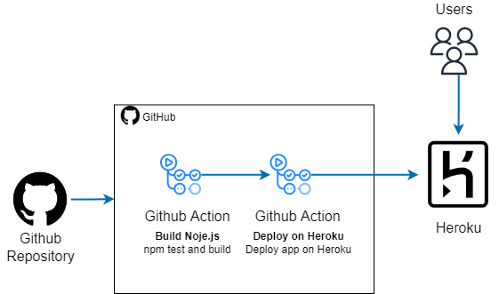

# Fake Countries API

API written in Node.js to provide a sample of data set to describing official languages spoken by countries.
This api is being used in exercise 2.

[https://fake-countries-api.herokuapp.com/countries](https://fake-countries-api.herokuapp.com/countries)

## CI/CD Architecture 🗼

Pipeline with Github Actions and deploy on Heroku :rocket:

  
   
  Figure 1: Infrastructure for Github Actions and Heroku

